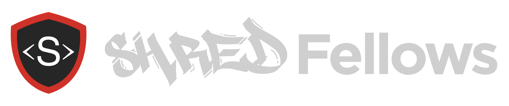

# 

GitHub Repo: [https://github.com/shredfellows/website](https://github.com/shredfellows/website)

Deployed site: [http://shredfellows.ccs.net/](http://shredfellows.ccs.net/)

## Project

This application is accsessible through canvas for CodeFellows students and as guest for everyone with a GitHub account. ShredFellows pulls data from github and displays a video and instructions that is relevant to a code challenge or challenges. The user can write and test code in a repl envirpnment. Students are able save their code and get a link to their solution to submit.

### Limitations

To use this app - it is assumed that the user has familiarity with the tech and frameworks listed below, and a GitHub account with the profile name filled out.

### Code

Standard JavaScript with React, ES6, SASS, CSS, HTML

### Tech/Framework Used

* babel-core
* babel-loader
* babel-plugin-transform-object-rest-spread
* babel-preset-es2015
* babel-preset-react
* css-loader
* eslint-plugin-react
* extract-text-webpack-plugin
* html-webpack-plugin
* node
* node-sass
* react
* react-dom
* react-redux
* resolve-url-loader
* sass-loader
* superagent
* webpack
* webpack-dev-server
* eslint

### Test runner

* jest-enzyme

## How to use?

* Step 1. Fork and Clone the Repository.
* Step 2. `npm install` on both Service and Website
* Step 3. Run Mongo DB
* Step 4. `npm run watch` Services, `npm run start` Website
* Step 5. You should now be able to visit: `http://localhost:8080` to log in to the application
* Step 6. Choose login with your github account
* Step 7. Choose a challenge from the menu and code away

## User Flow:

### &nbsp; Assignments for students:


```
  The "Pages" component checks for a GitHub token, if present it will open the assignment

  If there is no token, a GitHub login will be prompted 
```
### &nbsp; Assignments as a guest:

```
  Same "Pages" component determines if user is a guest by checking in the "assignment length" which in a guest case is 0.

  This prompts the GitHub login and displays the user's GitHub profile picture, and a sidebar menu with the assignments.
```

## Data Flow:

### Assignment components:

* README and Notes

```
  The "Readme" component fetches the README file from GitHub by URL
  Same component renders the click event to open a note. 
  Once the Note icon is clicked, the "Note" component handles change and submit events so the note is saved to the specific assignment
```
* Video

```
  The "Video" component renders it by URL
```

* Repl environment
```
Multiple components handle this part.
  "Rotator" component displays the challenges, uses a doubly
  linked list (the children of the component) structure from a .js file outside of the component, sets state to the active child in the list

  "Workspace" component runs code in the coderunner, with the "nel" module, to check for errors.  
    Same component generates the assignment link an the copy link field for canvas users only.

```

## Authors (in alphabetical order)

Khalil Ahmed, Jen Bach, Jason Burns, Timea Heidenreich, Ben Hurst, Justin Morris, Ovi Parasca, Michael Sklepowich

## Credits

To John Cokos and Catherine Looper for the research, help and guidance
